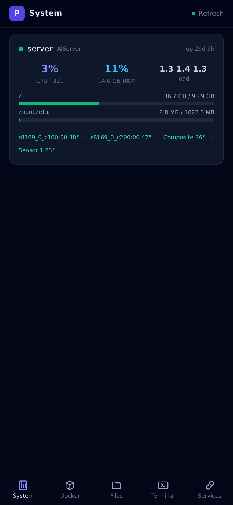

# pocketlab

**Your home server in your pocket.** A mobile-first PWA dashboard for developers
who self-host — live system stats, Docker controls, a real terminal, and an
SSH-capable file browser, driven by a single YAML file. Install it to your phone's
home screen and run your box from the couch, the train, or anywhere.

> Built for people who already live in a shell. pocketlab doesn't try to be a
> smart-home hub or a pretty status page for non-technical users — it's a
> touch-friendly control surface for the machines you actually administer.



---

## Why

You SSH into your home server constantly — to check what's hot, restart a wedged
container, grab a file, tail a log. Doing that from a phone is miserable: tiny
terminal text, no autocomplete, fumbling with `docker ps`. pocketlab puts the
five things you actually reach for behind a thumb-friendly bottom nav, as an
installable PWA that works offline-first and feels native.

It's deliberately small and boring: a self-contained FastAPI backend, one HTML
file, no build step, no database, no telemetry. Read the whole thing in an
afternoon.

## Features

| Widget | What it does |
|--------|--------------|
| **System** | CPU, memory, disk usage, temperatures, load, uptime — per host. Local via [psutil](https://github.com/giampaolo/psutil); remote hosts over SSH. |
| **Docker** | List every container with status; start / stop / restart with a tap. Local socket, `ssh://`, or `tcp://`. |
| **Terminal** | A genuine browser terminal (xterm.js) via [**mttyd**](https://github.com/JeremiahM37/mttyd) — touch scroll, command bar, the works. |
| **Files** | Browse, download and upload within configured roots. Local or over SSH. Access is confined to each root — no escaping with `..` or symlinks. |
| **Links** | A grid of shortcuts to your other self-hosted apps. Pure bookmarks, no backend. |

Each widget is opt-in. Your `widgets:` list is also the bottom-nav order.

## Quickstart

```bash
pip install pocketlab            # core
pip install 'pocketlab[all]'     # + Docker SDK + embedded terminal

curl -o pocketlab.yaml https://raw.githubusercontent.com/JeremiahM37/pocketlab/main/pocketlab.example.yaml
$EDITOR pocketlab.yaml

pocketlab                        # serves on http://0.0.0.0:8838
```

Open `http://<your-server>:8838` on your phone and **Add to Home Screen**. It
installs like a native app, icon and all.

### Docker

```bash
git clone https://github.com/JeremiahM37/pocketlab && cd pocketlab
cp pocketlab.example.yaml pocketlab.yaml && $EDITOR pocketlab.yaml
cp docker-compose.example.yml docker-compose.yml
docker compose up -d
```

The example compose file brings up pocketlab **and** a `ttyd` backend for the
terminal, wired together.

## Configuration

Everything lives in `pocketlab.yaml`. It's both the dashboard definition and the
**access-control boundary**: only the hosts, Docker endpoint, file roots and
terminal ports you list are reachable — anything else returns 403/404. See
[`pocketlab.example.yaml`](pocketlab.example.yaml) for the fully-annotated
template. The short version:

```yaml
title: "My Home Server"
widgets: [system, docker, files, terminal, links]

hosts:
  - { name: server, stats: local }
  - { name: nas, stats: { ssh: root@192.168.1.10 } }   # remote, over SSH

docker:
  host: local                # or ssh://user@host  /  tcp://host:2375

files:
  roots:
    - { name: home, host: local, path: "~" }           # quote ~ (bare ~ is YAML null)

terminal:
  mttyd_url: ""              # embedded mttyd; or point at a standalone one
  ports: [7681]

links:
  - group: Infra
    items:
      - { name: Grafana, url: "http://localhost:3000", icon: "📊" }
```

### Remote hosts use your real SSH

Remote stats and files go through the system `ssh` binary, so they honour your
`~/.ssh/config`, keys, and agent — the exact connection you already use from a
shell. No SSH passwords are stored anywhere; set up key auth
(`ssh-copy-id root@host`) and you're done. SSH targets never leave the server —
they're stripped from the config the browser sees.

### The terminal

The Terminal widget embeds [**mttyd**](https://github.com/JeremiahM37/mttyd)
(pocketlab's sister project — a mobile-friendly wrapper around `ttyd`). pocketlab
mounts it automatically when `terminal.mttyd_url` is empty. You just need a
`ttyd` running on each configured port (pocketlab doesn't spawn it):

```bash
ttyd -p 7681 -W bash
```

The terminal's WebSocket connects straight to the `ttyd` port, so that port must
be reachable from your phone. For mttyd's full feature set (command-history bar,
tmux session management), run [mttyd](https://github.com/JeremiahM37/mttyd)
standalone and set `terminal.mttyd_url` to its URL.

## Security

pocketlab exposes shells, container controls and your filesystem. Treat it like
the keys to the box:

- **Never put it on the public internet unauthenticated.** Keep it behind a VPN
  (Tailscale / WireGuard) or a reverse proxy with auth (Authelia, oauth2-proxy,
  Cloudflare Access). pocketlab has no built-in login by design — auth is the
  reverse proxy's job.
- The config is the allowlist: file roots are confined, unknown roots/ports are
  rejected, Docker actions are limited to start/stop/restart.
- A `ttyd -W` terminal is an **unauthenticated shell on its port** — gate it the
  same way.

## Development

```bash
python -m venv .venv && . .venv/bin/activate
pip install -e '.[test,all]'
pytest -q                        # unit + API tests
verify                           # full end-to-end (API + headless PWA) — see .verify.yaml
```

No build step — the frontend is a single hand-written `static/app.html` (Tailwind
via CDN). Edit and refresh.

## Architecture

```
pocketlab/
  config.py       pydantic config + the public() view sent to the browser
  system.py       psutil locally; a portable /proc probe over ssh for remotes
  docker_api.py   docker SDK wrapper (optional dep, degrades gracefully)
  files.py        browse/download/upload, confined to each root
  ssh.py          thin OpenSSH-binary wrapper
  server.py       FastAPI: serves the PWA + JSON API, mounts mttyd
  static/         app.html (the PWA), manifest.json, sw.js
```

## Related

- [**mttyd**](https://github.com/JeremiahM37/mttyd) — the mobile terminal that
  powers pocketlab's Terminal tab. Useful on its own.

## License

MIT — see [LICENSE](LICENSE).
